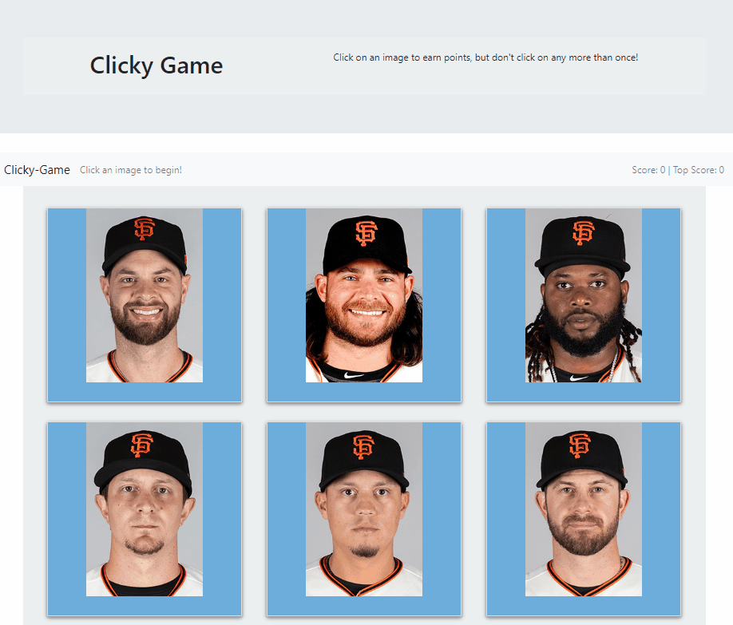

# clicky_game

Clicky Game is a memory game that counts each time a user clicks on the card of a baseball player that has not been previously selected. 

### Prerequisites

* [Visual Studio Code](https://code.visualstudio.com/)


### Installation Guide

* You will need to download this folder to your computer. You may do this either by downloading the document as a zip file, or by cloning the git repository to a folder on your computer using Git Bash. In order to do this, click the green button labled "Clone or Download", and select your method of retrieving the file.

* If you want to use the git clone method, your first step is to copy the link provided. From here, you want to navigate to the desired location on your computer in your Git Bash terminal, or navigate to the desired location via your explorer, right click and select "Git Bash Here". Within your Git Bash terminal, type the following: `git clone git@github.com:jdavis3333/clicky_game.git`

* Once the repository exists locally on your computer, navigate to within the newly downloaded folder using git bash, or use the "Git Bash Here" method to open the terminal within the correct folder.

* To ensure you are in the coorect folder, type the following and hit enter: `ls`

* Finally, you will need to ensure that all of the required npm packages are installed. Type the following into your Git Bash terminal: `npm i`

### Use



* Created app.js homepage
```
class App extends Component {

  render() {
    return (
      <div className="App">
      <MyJumbotron />
      <MyWrapper />  
      </div>
    );
  }
};    

export default App;
```      
* Created card array
```
   "id": 1,
        "name": "belt",
        "clicked": false,
        "image": "https://securea.mlb.com/mlb/images/players/head_shot/474832.jpg"

```
* Render cards to the page
```
<GiantsCard
              image={giantsPlayers.image}
              id={giantsPlayers.id}
              key={giantsPlayers.id}
              handleIncrement={this.handleIncrement}
            />
```
## Built With

* [Javascript](https://developer.mozilla.org/en-US/docs/Web/JavaScript)
* [React](https://reactjs.org/)
* [React Bootstrap](https://react-bootstrap.github.io/)


## Authors

* Joe Davis 

- [Link to Portfolio](https://gentle-bayou-48835.herokuapp.com/)
- [Link to Github](https://github.com/jdavis3333)
- [Link to LinkedIn](https://www.linkedin.com/in/joe-davis-a8380232/)


## License

This project is licensed under the 
